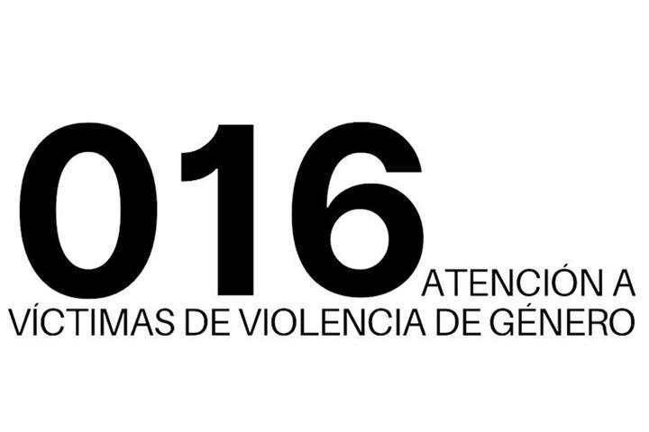
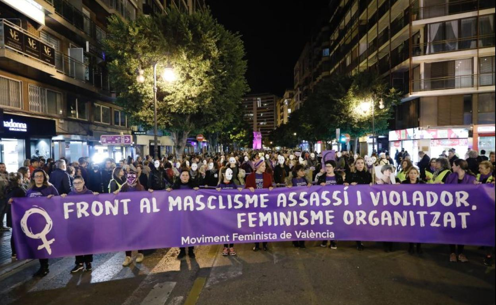

```{r packages-setup, include = FALSE}
library(tidyverse)
library(klippy)  
library(knitr)
library(readxl)
library(sf)
library(plotly)
library(gganimate)
library(hrbrthemes)
```

```{r chunk-setup, include = FALSE}
knitr::opts_chunk$set(echo = TRUE, eval = TRUE, message = FALSE, warning = FALSE, 
                      #results = "hold",
                      cache = FALSE, cache.path = "/caches/", comment = "#>",
                      #fig.width = 7, #fig.height= 7,   
                      #out.width = 7, out.height = 7,
                      collapse = TRUE,  fig.show = "hold",
                      fig.asp = 7/9, out.width = "60%", fig.align = "center")
knitr::opts_chunk$set(dev = "png", dev.args = list(type = "cairo-png"))
```

```{r options-setup, include = FALSE}
options(scipen = 999) #- para quitar la notación científica
options("yaml.eval.expr" = TRUE) 
```


```{r klippy, echo = FALSE}
klippy::klippy(position = c("top", "right")) #- remotes::install_github("rlesur/klippy")
```
<div style= "text-align: justify"><div/>
<hr class="linea-black">

Trabajo elaborado para la asignatura "Programación y manejo de datos en la era del Big Data" de la Universitat de València durante el curso 2020-2021. El repo del trabajo está [aquí](https://github.com/laualmos/trabajo_BigData){target="_blank"}. La página web de la asignatura y los trabajos de mis compañeros pueden verse [aquí](https://perezp44.github.io/intro-ds-20-21-web/07-trabajos.html){target="_blank"}.

<!-- El párrafo de arriba has de dejarlo casi igual, 
        solo HAS de SUSTITUIR las 2 veces que aparece "perezp44" por tu usuario de Github-->
        

<hr class="linea-red">
 
# <FONT COLOR= "e047b1"> **1. Introducción**<FONT>

El objetivo de este trabajo es reflejar la violencia que sufren las mujeres en España a partir de los datos disponibles en la Delegación del gobierno contra la Violencia de Género. La violencia de género ha sido el tema elegido para hacer este informe ya que, por desgracia, este tipo de violencia está presente en el conjunto del país y refleja una injustícia social, limitando los derechos y las libertades de las mujeres. De manera que, la misión mediante este estudio es hacer visible, concienciar y sensibilizar esta problemática que abunda en esta sociedad patriarcal.

En primer lugar, se analiza la evolución del número de llamadas pertinentes al 016. Este número de teléfono está vinculado a un servicio telefónico de atención a personas que están sufriendo posible violencia de género. Con este servicio, se ofrece información y asesoramiento frente a la situación en la que se encuentra la llamante.

Seguidamente, se plasmaran  el número de denuncias realizadas por este tipo de violencia contra la mujer. En este apartado, se examina tanto la evolución, como el origen de estas.

A continuació, se incide con el número de víctimas mortales.En este punto se consideran las mujeres asesinadas en manos de sus parejas,exparejas, o que estan en fase de separación. Además, también se distingue la edad del agresor en cuestión y, finalmente, se distingue por provincias y comunidades autónomas donde se concentran más caso de asesinato de mujeres.

Por último, se hace hincapié en la incidencia de la Crisis del Covid-19 en este problema social. Aquí se presta atención a los efectos derivados de la declaración del Estado de Alarma y del confinamiento domiciliario establecidos por el Gobierno de España.

En las conclusiones se inferirá en las cuestiones abordadas a lo largo del trabajo destacando las actuaciones y compromisos para combatir esta problemática, de manera que se consiga un igualdad efectiva entre mujeres y hombres.

```{r, eval=TRUE, echo=FALSE}

```


# <FONT COLOR= "e047b1"> **2. Datos** </FONT>
Los datos para realizar el informe se han sacado de la Delegación del Gobierno contra la Violencia de Género. Esta página web dispone de un portal estadístico donde se encuentran diversas variables de estudios y sus respectivas clasificaciones.

Por lo que, los datos se han descargado en formato Excel, de manera que se ha precisado del paquete **readxl**. Seguidamente se han creado las rutas para dotar de data frames, con la funció **read_excel**.

En cuanto a los datos, bajo mi punto de vista, considero que no reflejan la realidad exacta, ya que inciden muchos factores dentro de este tipo de violencia hacia las mujeres, que no estan recogidos en ninguna estadística y por tanto, no se tiene constancia de ello. Con esto me refiero a las agresiones y maltratos psicológicos, los micromachismos o la subordinació de la mujer en el ámbito doméstico, entre otras.

```{r, eval = TRUE, echo= FALSE}
library(readxl)
```


## <FONT COLOR= "e047b1"> **2.1. Procesando los datos** </FONT> {.tabset}

Una vez creados los data frames, se procede a modificar estos para que la manipulación de datos y elaboración para realizar diversos gráficos, tablas y mapas sea más sencilla y adecuada a lo que se pretende mostrar.
En este caso, es necesario el paquete **tidyverse** para utilizar el operador **pipe** y a su vez, facilitar la lectura e interpretación del código. Además de poder transformar los dataframes considerados en este trabajo.
La modificación de los data frames se ha basado, en primer lugar, por simplificar el nombre de las columnas, de manera que permite un mejor manejo. Para esto, se ha utilizado la función **rename**. Otro procesamiento que se ha tenido que hacer en la mayoria de data frames es convertir las variables que indican el período, ya que estas, en los datos primarios disponibles estaban en formato texto. Por lo que, para convertir a formato numérico se ha recurrido a la función **mutate**. Para finalizar, se borran los data frames los cuales se puede prescindir de ellos, y se mantiene en el que se va a trabajar. Además, se requieren otros paquetes como el **plotly** o **hrbrthemes** para suplementar los gráficos. Así como, para producir este informe se necesita el paquete **knitr**.

### Data Frames {.tabset}

```{r, eval = TRUE}
df_llamadas<-read_excel("./datos/llamadas016.xlsx")
df_denuncias<-read_excel("./datos/denuncias.xlsx")
df_victimas<-read_excel("./datos/victimas.xlsx")
df_tramoedad<- read_excel("./datos/victimas1.xlsx")
df_mapa<- read_excel("./datos/provinciasCCAA.xlsx")
load("./datos/geometrias.RData")
CCAA <- rio::import("https://github.com/perezp44/LAU2boundaries4spain/blob/master/data/CCAA.rda?raw=true")
objetos_no_borrar<-c("df_llamadas", "df_denuncias", "df_victimas", "df_tramoedad", "df_mapa", "CCAA", "Provincias")
rm(list = ls()[!ls() %in% objetos_no_borrar])
```

### Modificación de Data Frames {.tabset}

```{r, eval = TRUE}
#Dataframe de llamadas al 016
df<-df_llamadas%>% rename(llamadas= `Número de llamadas pertinentes`)
df_wide<- df%>%pivot_wider(names_from = Año, values_from= llamadas)
df_wide<- df_wide%>% rename("2007"= `Año 2007`,"2008"= `Año 2008`,"2009"= `Año 2009`, "2010" = `Año 2010`, "2011" = `Año 2011`, "2012"= `Año 2012`, "2013"= `Año 2013`, "2014"= `Año 2014`, "2015"= `Año 2015`, "2016"= `Año 2016`, "2017"= `Año 2017`, "2018"= `Año 2018`, "2019"= `Año 2019`, "2020"= `Año 2020`)
df<-df_wide%>%pivot_longer(cols = 1:14, names_to = "Año") 
df_llamadas<- df%>%rename(Numero_llamadas = value)%>%mutate(Año.num = as.numeric(as.character(Año)))

#Dataframe de denuncias por v.g
df<-df_denuncias%>% rename(Numero_denuncias= `Número de denuncias por violencia de género`, Origen_denuncia = `Origen de la denuncia`)
df_wide<- df%>%pivot_wider(names_from = Año, values_from= Numero_denuncias)
df_wide<- df_wide%>% rename("2009"= `Año 2009`, "2010" = `Año 2010`, "2011" = `Año 2011`, "2012"= `Año 2012`, "2013"= `Año 2013`, "2014"= `Año 2014`, "2015"= `Año 2015`, "2016"= `Año 2016`, "2017"= `Año 2017`, "2018"= `Año 2018`, "2019"= `Año 2019`, "2020"= `Año 2020`)
df<-df_wide%>%pivot_longer(cols = 2:13, names_to = "Año") 
df_denuncias<- df%>%rename(Numero_denuncias = value)%>%mutate(Año.num = as.numeric(as.character(Año)))
df_denuncias<-df_denuncias%>% select(Origen_denuncia, Año.num, Numero_denuncias)

#evolución por años de las denuncias
df_denuncias0<- df_denuncias%>%select(Año.num, Numero_denuncias)
df_denuncias0<- df_denuncias0%>%group_by(Año.num)%>%mutate(denuncias_acumuladas_por_año = sum(Numero_denuncias))
#Origen de denuncias
df_denuncias1<- df_denuncias%>% select(Origen_denuncia, Numero_denuncias)
df_denuncias1<- df_denuncias%>%transform(df_denuncias, Origen_denuncia = reorder(Origen_denuncia, -Numero_denuncias))
#Victimas mortales
df<-df_victimas%>% rename(victimas = `Número de mujeres víctimas mortales`)
df_wide<- df%>%pivot_wider(names_from = Año, values_from= victimas)
df_wide<- df_wide%>% rename("2003"= `Año 2003`, "2004"= `Año 2004`,"2005"= `Año 2005`, "2006"= `Año 2006`, "2007"= `Año 2007`,"2008"= `Año 2008`,"2009"= `Año 2009`, "2010" = `Año 2010`, "2011" = `Año 2011`, "2012"= `Año 2012`, "2013"= `Año 2013`, "2014"= `Año 2014`, "2015"= `Año 2015`, "2016"= `Año 2016`, "2017"= `Año 2017`, "2018"= `Año 2018`, "2019"= `Año 2019`, "2020"= `Año 2020`)
df<-df_wide%>%pivot_longer(cols = 2:19, names_to = "Año") 
df_victimas<- df%>%rename(Numero_victimas = value, Relacion = `Pareja - Expareja`)%>%mutate(Año.num = as.numeric(as.character(Año)))


#Tramo de edad
df<- df_tramoedad%>%rename(Tramo_edad = `Tramo de edad Agresor`, victimas = `Número de mujeres víctimas mortales`)
df_wide<- df%>%pivot_wider(names_from = Tramo_edad, values_from= victimas)
df<-df_wide%>% rename("16_17" = `16-17 años`, "18_20" = `18-20 años`, "21_30" = `21-30 años`, "31_40" = `31-40 años`, "41_50" = `41-50 años`, "51_60" = `51-60 años`, "61_70" = `61-70 años`, "71_84" = `71-84 años`,">85"= `>=85 años`, No_consta= `No consta`)
df<- df%>%pivot_longer(cols = 2:11, names_to = "Tramo_edad")
df<- df%>%rename(Numero_victimas = value, Relacion = `Pareja - Expareja`)
df_tramoedad<-df%>%filter(!is.na(Numero_victimas))

#mapas 
df_mapa<-df_mapa %>% rename(CCAA = `Comunidad autónoma`, Victimas = `Número de mujeres víctimas mortales`)
df_mapa1<- full_join(Provincias, df_mapa, by = c("NombreProv" = "Provincia"))
df_mapa1<- df_mapa1%>% select(c(NombreProv, NombreCCAA, geometry, Victimas))

df_mapa2<- df_mapa%>%mutate(Total = sum(Victimas)) %>%group_by(CCAA)%>% mutate(victimas_por_CCAA = sum (Victimas))%>%mutate(percent = victimas_por_CCAA/Total *100)
mapaCCAA<- full_join(df_mapa2, CCAA, by = c("CCAA" = "NombreCCAA"))
#tabla covid llamadas
df_1<-df_llamadas%>%select(Año.num, Numero_llamadas)%>%group_by(Año.num)%>%summarise(llamadas_por_año = sum(Numero_llamadas))
df_1<-df_1%>%pivot_wider(names_from = Año.num, values_from= llamadas_por_año)
df_1<-df_1%>%rename(año_2019= "2019", año_2020 = "2020")%>%select(año_2019, año_2020)%>%mutate(diferencia = (año_2020 - año_2019)/año_2019 *100)
df_2<-df_victimas%>%select(Año.num, Numero_victimas)%>%group_by(Año.num)%>%summarise(Victimas_por_año = sum(Numero_victimas))
df_2<-df_2%>%pivot_wider(names_from = Año.num, values_from= Victimas_por_año)
df_2<-df_2%>%rename(año_2019= "2019", año_2020 = "2020")%>%select(año_2019, año_2020)%>%mutate(diferencia = (año_2020 - año_2019) /año_2019 * 100)
df_3<-df_denuncias%>%select(Año.num, Numero_denuncias)%>%group_by(Año.num)%>%summarise(denuncias_por_año = sum(Numero_denuncias))
df_3<-df_3%>%pivot_wider(names_from = Año.num, values_from= denuncias_por_año)
df_3<-df_3%>%rename(año_2019= "2019", año_2020 = "2020")%>%select(año_2019, año_2020)%>%mutate(diferencia = (año_2020 - año_2019) /año_2019 * 100)
objetos_no_borrar<-c("df_llamadas", "df_denuncias", "df_victimas", "df_denuncias0", "df_denuncias1", "df_tramoedad", "df_mapa1", "df_1", "df_2", "df_3","mapaCCAA")
rm(list = ls()[!ls() %in% objetos_no_borrar])
```

### Paquetes {.tabset}

  - library(tidyverse)
  - library(klippy)  
  - library(knitr)
  - library(readxl)
  - library(sf)
  - library(plotly)
  - library(gganimate)
  - library(hrbrthemes)
  - library(readxl)


# <FONT COLOR= "e047b1"> **3. Estudio de la Violencia de Género** </FONT>

El concepto de la violencia de género engloba diversas definiciones, así pues, la Organización Mundial de la Salud (OMS) establece que las Naciones Unidas definen la violencia contra la mujer como:

> "Todo acto de violencia de género, que resulte, o pueda tener como resultado un daño físico, sexual o psicológico para la mujer, inclusive las amenazas tales como actos, la coacción o la privación arbitraria de libertad, tanto si se producen en la vida pública como en la privada"

Así pues, el Programa de las Naciones Unidas para el Desarrollo aporta la definición como:

> "La violencia sexual y de género es una violación de los derechos básicos que se da en todas las regiones y continentes del mundo, e impide que las mujeres ejerzan sus derechos economicos y políticos.".

Ambas definiciones nos dan una visión de que en la violencia de género tiene como resultado todo tipo de daño hacia la mujer, solo por el mero hecho de serlo. Y que está presente, por desgracia, en todas las partes del mundo y no solo en nuestro país.

Por otro lado, desde el Instituto de la Mujer y para la Igualdad de Oportunidades de España, dentro del Ministerio de Sanidad, Servicios sociales e Igualdad, precisan que la violencia de género como:

> "Es aquella que se ejerce sobre las mujeres por parte de quienes estén o hayan estado ligados a ellas por relaciones de afectividad (parejas o ex-parejas), cuyo objetivo del agresor es producir daño y conseguir el control sobre la mujer, por lo que se produce de manera continuada en el tiempo y sistemática en la forma, como parte de la misma estrategia".

Y a su vez, declaran que:

> "Ha sido y sigue siendo una de las manifestaciones más claras de la desigualdad, subordinación y de las relaciones de poder de los hombres sobre las mujeres".

Como se manifiesta anteriormente, la Violencia de Género es un delito que vulnera los derechos de la mujer, asi como denota discriminación y limita el desarrollo de este colectivo. 
Para fundamentar esta evidencia se contrastan diversos datos.

## <FONT COLOR= "e047b1"> **3.1. Llamadas al número 016.** </FONT>

En este apartado se va a plasmar la evolución del número de llamadas pertinentes al 016. Como se ha referido anteriormente, este número oferta un servicio de atención para mujeres que sufren violencia de género. Esta llamada se puede realizar mediante un teléfono móvil o de manera online, de forma totalmente gratuita y sin constancia de ella. Es decir, no aparece el registro en la factura del movil,para así, evitar que el maltratador esté al corriente. Pero a su vez, se queda reflejada en la lista de llamadas realizadas en este aparato, por lo que se recomienda llamar desde un número público o ajeno a la víctima.
  
```{r, eval=TRUE, echo=FALSE}

```
 
  
En el siguiente gráfico se puede ver la evolución de los llamamientos a este número desde el 2007 hasta el 2020. Examinandolo, podemos ver que el año donde se registró mayores llamadas fue en el 2016. 
Otro rasgo llamativo en este gráfico es el aumento sustancial de llamadas pertinentes entre el 2007 y 2008. Esto se debe a que este número empezó a ser operativo en el año 2007, de manera que se reconoció este servicio exclusivamente para las mujeres que se encuentran frente a esta situación. 

Para la realización del gráfico se ha utilizado las funciones **geom_point** y **geom_line**.

```{r, eval = TRUE, echo= FALSE}
a<-ggplot(df_llamadas, aes(Año.num, Numero_llamadas)) + geom_line(color = "magenta") + geom_point(color = "magenta") + theme_modern_rc() + labs(title = "Gráfico 1: Evolución del número de llamadas", subtitle = "desde el año 2007 hasta el 2020")
a

```

## <FONT COLOR= "e047b1"> **3.2. Denuncias por violencia de género.** </FONT>

Aquí se plasman las denuncias realizadas por delitos relacionados con la Violencia de Género. 
Se ha realizado el mismo porcedimiento que en el anterior gráfico. En primer lugar, se representa la evolución de denuncias por años, desde el 2009 hasta el 2020. 

```{r, eval = TRUE, echo= FALSE}
b<- ggplot(df_denuncias0, aes(Año.num, denuncias_acumuladas_por_año)) + geom_line(color = "magenta") + geom_point(color = "magenta") + theme_modern_rc() + labs(title = "Gráfico 2: Evolución del número de denuncias", subtitle = "desde el año 2009 hasta el 2020")
b
```

Por lo que mediante el análisis de este gráfico se puede evidenciar que a partir del 2013 se experimentó un aumento de las denuncias por Violencia de Género, llegando en 2019 a un total de 168.168 denuncias registradas.  Esto puede reflejar que el miedo de las víctimas a ser estigmatizadas por denunciar a su maltratador aminoró debido a la mayor presencia de conciencia generada a lo largo de los años.

En adición, se refleja una caída drástica en el último año, coincidiendo con la incidencia de la pandemia causada por el *Covid-19*. Donde todo indica a que pueda ser el efecto del confinamiento domiciliario y la cuarentena, como se indicará un apartado posteriormente.

Por otro lado, se distingue el origen de la denuncia. Es decir, quien ha sido el encargado de presentar la denuncia por malos tratos hacia la mujer. En este caso, se distinguen siete tipos: 

  - Presentada por la víctima en juzgado.
  - Presentada por familiares de la víctima en juzgado.
  - Atestado policial con denuncia de la víctima.
  - Atestado policial con denuncia de familiares.
  - Atestado policial por intervención directa.
  - Parte de lesiones.
  - Servicios de asistencia y terceros en general

En este gráfico se denota el dominio de denuncias realizadas por atestado policial con denuncia de la víctima, con un total de 1.058.861. Por intervención directa policial se encuentra un total de 235.649 denuncias realizadas, mientras que las denuncias de origen por parte de lesiones son 173.476. Por otro lado, las presentadas directamente por la víctima en juzgado se posiciona en cuarto lugar, por lo que refleja el miedo y la inseguridad de la víctima frente a su maltratador. El total de estas denuncias es de 92.889. Las denuncias con origen de servicios de asistencia y terceros en general, por parte de atestado policial con denuncia de familiares y, presentada por familiares de la víctima en juzgado, respectivamente, representan un total de 38.864, 21.577 y 7.320 denuncias.
 
```{r, eval = TRUE, echo= FALSE}
c<-ggplot(df_denuncias1, aes(Origen_denuncia, Numero_denuncias, fill= Origen_denuncia)) + geom_bar(stat="identity")+ theme_bw() + theme(axis.text.x = element_blank())+ labs (title = "Gráfico de barras: Número de denuncias según su origen")
c + theme(legend.background = element_rect(fill="seashell",
                                  size=0.5, linetype="solid", 
                                  colour ="gray0"))


```

Para elaborar este gráfico se ha usado la función **geom_bar**.

## <FONT COLOR= "e047b1"> **3.3. Victimas mortales por violencia de género** </FONT>

En esta sección se va a hacer referencia a diversas clasificaciones:

### <FONT COLOR= "e047b1"> **3.3.1 Relación de la víctima con el agresor.** </FONT>

Como se ha referido anteriormente, la violencia de género recoge en su definición que este tipo de violencia es la que se genera a una mujer por parte de la persona con la que tiene o ha tenido una relación sentimental. Por lo que se distingue tres tipos: 

  - si la agresión se ha ejecutado por la pareja de la víctima
  - si la ha llevado a cabo su expareja
  - si la víctima y el agresor se encuentran en situación de separación

Por tanto, para constatar cual es el mayor número de mujeres asesinadas, en función de la relación que mantenia con su homicida, se se ha recurrido a un gráfico de puntos o *Scatter plot* que simboliza la evolución individual de los tres tipos de relación entre la víctima y el asesino. Se evidencia, por tanto, el predominio de las victimas mortales a manos de su pareja, seguida por su expareja y, finalmente, si se encuentran en fase de separación.


```{r, eval = TRUE, echo= FALSE} 
pp<-ggplot(df_victimas, aes(x = Año.num, y =Numero_victimas, color = Relacion)) +
 geom_point() + ylim(0, 50) + facet_grid(rows = vars(Relacion)) + theme(legend.position = "bottom") + theme(legend.key.size = unit(2.4, "cm")) +theme_ipsum() + theme(legend.background = element_rect(fill="lightyellow", size=0.5, linetype="solid", colour ="grey78"))+ theme(legend.position = "none") + labs (title = "Scatter plot: Número de víctimas por años en función de la relación con el agresor") +theme(plot.title = element_text(face = "bold", size = 8, vjust = 1,5))
ggplotly(pp)
```

Aquí, se aprecia en primer lugar, como se ha dicho anteriormente,  en qué año fueron más mujeres victimas mortales por violencia de género. En 2010 fue el año donde más mujeres murieron, siendo 44, en manos de su marido. Por otro lado, el mayor número de mujeres asesinadas por su expareja fue en 2008, estas  fueron 22. Por último, 16 mujeres que se encontraban en fase de separación con su esposo murieron en el 2015, y, otras 16 en el 2016, siendo estos los años donde se registraron más muertes por violencia de género en manos de este agresor.

### <FONT COLOR= "e047b1"> **3.3.2. Tramo de edad del agresor.** <FONT>
 
 Por otra parte, se ha clasificado el número de víctimas, a parte de por la relación que se establece entre la víctima y su homicida, distinguiendo el tramo de edad de este último.
 En este gráfico de barras se muestra la clasificación siguiente:
 
En el caso de mujeres asesinadas en manos de su pareja y las víctimas que se encontraban en fase de separación, el principal perfil del agresor se encuentra en un rango de edad entre 31 y 40 años. Por debajo de  estos, a su vez, predomina los hombres de 41 a 50 años. En cambio, los asesinatos por parte de la expareja, suceden a la inversa, siendo los agresores entre 41 y 50 años los predominantes. 

 Por otro lado, hay un número de victimas en la que no se conoce la edad del homicida. Dentro de este, son 21 las mujeres asesinadas por su expareja, 47 en el caso de que el agresor era la pareja actual y,  10 que se encontraban en fase de separación, la edad de estos agresores no está registrada.
 
 
```{r, eval = TRUE, echo= FALSE}

ab<-ggplot(df_tramoedad, aes(fill=Tramo_edad, y=Numero_victimas, x=Relacion)) + 
    geom_bar(position="dodge", stat="identity") + theme_tinyhand() + theme(text = element_text(face = "bold")) + theme(legend.background = element_rect(fill="seashell",
                                  size=0.5, linetype="solid", 
                                  colour ="gray0")) + theme(axis.text.x = element_text( size = 12, angle= 90, hjust = 0.5, vjust = 0.5)) + labs (title = "Gráfico de Barras: Número de víctimas mortales por relación y tramo de edad ") +theme(plot.title = element_text(face = "bold", size = 8))
ggplotly(ab)
```

### <FONT COLOR= "e047b1"> **3.3.3 Distribución en España de mujeres asesinadas.** </FONT> {.tabset}

#### <FONT COLOR= "e047b1"> **Distribución por provincias de mujeres asesinadas** </FONT> {.tabset}

En esta parte del trabajo, se plasma la distribución por provincias del número de mujeres victimas mortales. Para mostrar este reparto se ha recurrido a un **mapa** de España, cargando un data frame con los datos geoespaciales.Estos datos vienen acompañados por un **GRS** de forma que se puede utilizar las aplicaciones **GIS**, y a su vez, manipular y mostrar correctamente estos datos. Además, mediante la función **geom_sf** del paquete correspondiente,**sf**, se configura el mapa de España, dividido por provincias donde se distribuyen el número de víctimas mortales por violencia de género 

Examinando el mapa, son Madrid y Barcelona las que presentan más casos de asesinatos en comparación con el resto de provincias, debido a que concentran un mayor porcentaje de población.
 

```{r, eval = TRUE, echo= FALSE}
g<- ggplot(df_mapa1,aes(geometry = geometry)) + geom_sf(aes(fill= Victimas)) + coord_sf(xlim = c(-20,10)) + annotate(geom = "text", x = 4, y = 37, label = "Mar Mediterráneo", fontface = "italic", color = "grey22", size = 3) + labs (title = "Mapa 1: Distribución del número de víctimas mortales por violencia machista",
       subtitle = "Por províncias",
       caption = "Datos provenientes de la Delegación del Gobierno contra la violencia de género") + theme_void() 
g + scale_fill_viridis_c(alpha = .6)

```

#### <FONT COLOR= "e047b1"> **Distribución por Comunidades Autónomas de mujeres asesinadas** {.tabset}

En el caso de CCAA, se ha realizado el porcentaje del total de las víctimas mortales, por lo que se representa que Andalucía, Cataluña y  la Comunidad Valenciana asentan mayores tasas de muertes. Mientras que las que presentan menos son, La Rioja, Cantábria, Navarra y Extremadura.

```{r, eval=TRUE, echo=FALSE}

f<-ggplot(mapaCCAA, aes(geometry=geometry)) + geom_sf(aes(fill = percent)) +labs (title = "Mapa 2: Distribución del número de víctimas mortales por violencia machista",
       subtitle = "Por Comunidades Autónomas",
       caption = "Datos provenientes de la Delegación del Gobierno contra la violencia de género") + theme_void()
f + scale_fill_viridis_c(alpha = .6)
```


### <FONT COLOR= "e047b1"> **3.3.4. Los efectos del Covid-19 sobre la violencia de género.** </FONT>

La pandemia causada por el virus *Covid-19* ocasionó una serie de nuevos comportamientos para la sociedad. El Gobierno de España decretó un **Estado de Alarma** y el establecimiento del **confinamiento y cuarentena nacional** a partir del día 13 de marzo del 2020. 
El 21 de junio se anunció el final del Estado de Alarma, pero con restricciones que mostraron una *Nueva Normalidad* para la población española. El 25 de octubre, el Consejo de Ministros volvió a establecer el Estado de Alarma, aunque esta vez con medidas menos estrictas. Estas son, principalmente, un toque de queda, la prohibición de viajar entre comunidades autónomas, y la limitación de grupos a seis personas no convivientes.

La medida excepcional de confinamiento domiciliario para contener el número de contagios apuntó en un recorte modesto de llamadas al 016, como se evidencia en la tasa anual acumulativa de los datos entre el 2019 y 2020. El número de llamadas para demandar socorro por parte de mujeres víctimas solo disminuyó en un 0.12% aproximadamente. Demostrando que, los maltratos hacia la mujer por el mero hecho de serlo contínuan presentes y precisan de los recursos que ofertan estos servicios en atención a la violencia.


<CENTER>Fórmula: $TMAA = ((X_{2020} / X_{2019})/X_{2019} )*100$</CENTER>


```{r, eval=TRUE, echo= FALSE}
knitr::kable(df_1)
```

Ahora bien, en el caso de las denuncias sí se refleja el impacto de las medidas establecidas con el objetivo de descender los casos de contagios. Como se ha refenciado antes, el confinamiento causó que la población permaneciera en sus viviendas, suponiendo una presión sobre las mujeres que soportan coacción por parte de su conviviente para no presentar denuncia.Por ello, esta situación de aislamiento y control sobre la mujer provocó, como se evidencia en la siguiente tabla, una disminución en 2020 de más de la mitad de denucias que se registraron en el año anterior.

```{r, eval=TRUE, echo= FALSE}
knitr::kable(df_3)
```
Por otro lado, la tasa de víctimas anual acumulativa realizada, muestra también un descenso del 18% aproximadamente. Una de las causas principales de este dato es, relacionado con lo expresado anteriormente,
el hecho de que el agresor domine los movimientos de su conyuge diariamente. 


```{r, eval=TRUE, echo= FALSE}
knitr::kable(df_2)
```

# <FONT COLOR= "e047b1"> **4. Conclusiones** </FONT>


Como conclusión, mediante lo demostrado a lo largo del trabajo, se puede evidenciar a día de hoy que, la violencia sigue siendo un problema en nuestra sociedad que repercute y damnifica a las mujeres víctimas de esta violencia. 

Este concepto tiene diversas definiciones, como se ha referenciado, según el órgano o la entidad que las ofrece, pero el eje central es el daño hacia la mujer. 

El impacto que la violencia de género ejerce sobre la salud de la víctima tiene consecuencias perjudiciales tanto en su proceso de desarrollo personal y emocional, como en el de socialización e inclusión en una sociedad en continuo cambio y evolución.

La violencia es una herramienta que facilita el mantenimiento de la situación de poder del hombre contra la mujer, por eso, él agrede, manipula, arremete, ataca, entre otras cosas, porque este se siente superior a ella y por tanto  quiere tener el dominio sobre la mujer.

Es importante tener en cuenta que la violencia contra la mujer adopta muchas formas, la más importante es el maltrato psicológico que tiene diversas manifestaciones como la violencia verbal, amenazas, gritos, insulto.

Como se ha analizado anteriormente, la crisis de *Covid-19*, además de afectar económicamente, ha tenido un impacto, especialmente, modificando las relaciones sociales,de manera que se han ralentizado los avances en términos de violencia de género.

Ante esta situación, es muy importante llevar a cabo acciones y medidas para defender y asegurar la igualdad de género. Algunas de ellas son, en primer lugar, concienciar a la sociedad, así como, movilizar a esta. En este caso, se requiere de una mayor transparencia a la hora de informar sobre esta problemática. Aquí, desde mi punto de vista, quiero destacar el trato de los medios de comunicación en este tema. Ya que se elaboran muchas notícias relacionadas con la violencia de género donde, tanto de manera indirecta como de manera directa (en el titular), se han intercambiado los papeles los partícipes del hecho. Es decir, al hombre, mediante el artículo, le corresponde el papel de víctima. [Aquí](https://www.pikaramagazine.com/2019/12/machismo-y-medios-lo-peor-de-2019/) podéis encontrar algunos de los ejemplos.

De esto deriva también, la necesidad de educar a la población bajo un lenguaje inclusivo, eliminar los micromachismos, invertir en la igualdad entre los géneros y potenciar el empoderamiento de las mujeres. Ya que, de una forma u otra, se tiende a justificar al maltratador y a culpabilizar a la víctima, como se puede mostrar en el ejemplo anterior.
A su vez, también se requiere de voluntad política en esta cuestión. Mediante políticas de inserción, la implantación un sistema educativo igualitario,así como, adaptar y crear leyes que protejan los derechos de las mujeres, a la vez que estas aseguren que se haga justícia.

Finalmente, subrayar que el dia 25 de noviembre es el día internacional de la *Eliminación de la Violencia contra la Mujer*. Durante esta jornada, se realizan campañas de sensibilización y apoyo a las víctimas de violencia de género, así como manifestaciones multitudinarias con el objetivo de erradicar esta injusticia social.

```{r, eval=TRUE, echo=FALSE}


```
<CENTER>Foto 1: *Promotoras en acción*</CENTER>
<CENTER>Foto 2: *Las Províncias*</CENTER>

# <FONT COLOR= "e047b1"> **5. Trabajos inspirados** </FONT>

Los trabajos y herramientas que se ha basado para realizar este informe son los siguientes:

- [Tutoriales programación y manejo de datos](https://perezp44.github.io/intro-ds-20-21-web/04-tutoriales.html)
- [R graph gallery](https://www.r-graph-gallery.com/index.html)


# <FONT COLOR= "e047b1"> **5. Bibliografia** </FONT>

La información y datos empleados:

- [Organización Mundial de la Salud](https://rstudio.com/wp-content/uploads/2015/04/ggplot2-spanish.pdf)
- [Programa de las Naciones Unidas para el Desarrollo](https://www.undp.org/content/undp/es/home/gender-equality/gender-based-violence.html)
- [Instituto de la mujer y para la Igualdad de Oportunidades](https://www.inmujer.gob.es/servRecursos/formacion/Pymes/docs/Introduccion/02_Definicion_de_violencia_de_genero.pdf)
- [Delegación del Gobierno contra la Violencia de Género](https://violenciagenero.igualdad.gob.es/violenciaEnCifras/home.htm)


<div class = "caja-medium-aquamarine">
 
</div>

<br>

<div class = "caja-crimson">
 
</div>

<br>

<div class = "caja-darkkhaki">

</div>


<br>

<div class = "caja-linea-verde">

</div>


<br>

<hr class="linea-red">


<div class = "caja-gris-gainboro">

</div>


